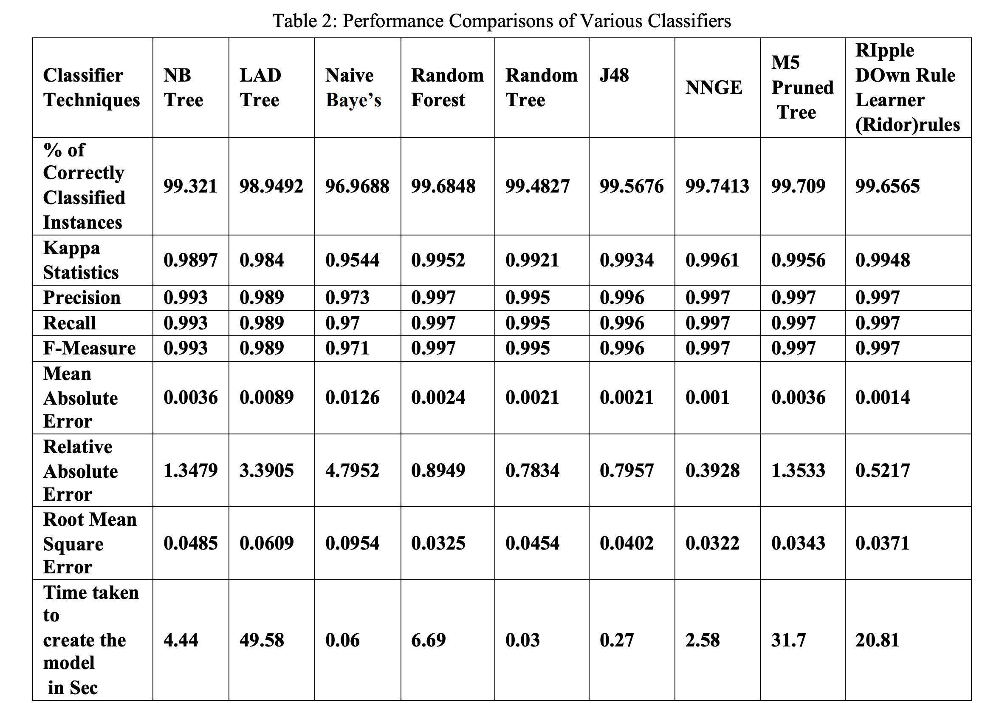
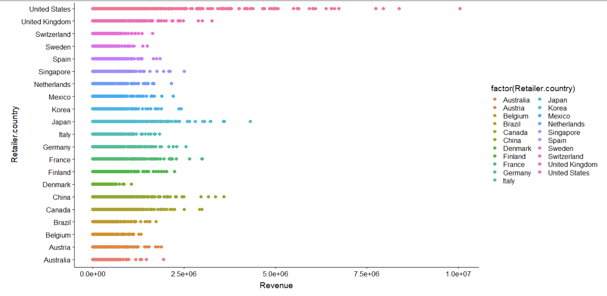

## Predicitve analytics on Sales:

* Publication: *[Effective Analysis of Sales Data Set Using Advanced Classifier Techniques](https://www.jardcs.org/abstract.php?id=3257#)*, Journal of Advanced Research in Dynamical and Control Systems, Nov 2019. 

PDF of the paper: [here](https://github.com/gvsakashb/bi-sales/blob/master/my-paper.pdf)
* Preprocessing:  Dimensionality reduction using PCA, and later used k-Means for data extraction, clustering.
* Analysis: Implemented machine learning models to explore customer purchase and behavior patterns, with SVM & Random Forest supervised techniques.
* Tabulated the results for 140k records and visualized patterns against 13 attributes, in customized sales pipelines. Presented this as a white paper and later explored BI solutions. 

* Results & future: Tested with Python & Weka, and documented results for various feature engineering models(Best reuslt - NNGE & M5P Trees). Extended study into BI applications was done - including operations of decision support, data management frameworks, Query and reporting with OLAP, etc. Published these results in the above mentioned paper.
> An extended study on this by Mr. Ramesh(co-author) was later published in Springer - *A Comparative Study of Data Mining Tools and Techniques for Business Intelligence*.

 
---

**Footnotes**
>    * The main linear technique for dimensionality reduction, PCA performs a linear mapping of the data to a lower-dimensional
space in such a way that the variance of the data in the low-dimensional representation is maximized. 
>    * In practice, the covariance (and sometimes the correlation) matrix of the data is constructed and the eigenvectors 
on this matrix are computed. The eigenvectors that correspond to the largest eigenvalues (the principal components) 
can now be used to reconstruct a large fraction of the variance of the original data. 
>    * Moreover, the first few eigenvectors can often be interpreted in terms of the large-scale physical behavior of 
the system. The original space (with dimension of the number of points) has been reduced (with data loss, but 
hopefully retaining the most important variance) to the space spanned by a few eigen vectors.
